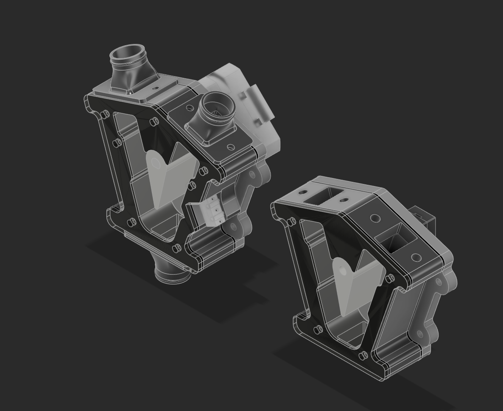

# cflap-rework

An open-source air divider ("flap") for CPAP-based part cooling on 3D printer toolheads. A flap inside the divider, driven by a servo or a stepper, routes the air from a single CPAP blower between outlets.

> **Status: early release.** Ready-to-print STL files are available for the **servo version**. STEP files are available for the main bodies of both the servo and the stepper version, and for the air hose adapters. STL files for the stepper version and the printer macros will follow in later releases.



## Repository layout

```
stl/
├── servo/                  # Servo-driven divider
│   ├── mainbody.stl
│   ├── flap.stl
│   ├── top_cover.stl
│   ├── top_cover_tpu_seal.stl
│   ├── bottom_plate.stl
│   └── bottom_plate_tpu_seal.stl
└── air hose adapter/       # Hose adapters for the Mellow CPAP
    ├── Mellow_cpap_hose_intake.stl
    └── Mellow_cpap_hose_exhaust_2x.stl
cad/
├── servo/
│   └── CFLAP.step          # Main body, servo version
├── stepper/
│   └── CFLAP.step          # Main body, stepper version
└── air hose adapter/
    ├── Mellow_cpap_hose_intake.step
    └── Mellow_cpap_hose_exhaust_2x.step
```

## Parts to print

### Servo version (`stl/servo/`)

| Part                        | Qty | Material        | Notes                          |
| --------------------------- | --- | --------------- | ------------------------------ |
| `mainbody.stl`              | 1   | ABS / ASA       |                                |
| `flap.stl`                  | 1   | ABS / ASA       |                                |
| `top_cover.stl`             | 1   | ABS / ASA       |                                |
| `bottom_plate.stl`          | 1   | ABS / ASA       |                                |
| `top_cover_tpu_seal.stl`    | 1   | TPU             | Seals the top cover            |
| `bottom_plate_tpu_seal.stl` | 1   | TPU             | Seals the bottom plate         |

### Hose adapters (`stl/air hose adapter/`)

| Part                              | Qty | Material  | Notes                                   |
| --------------------------------- | --- | --------- | --------------------------------------- |
| `Mellow_cpap_hose_intake.stl`     | 1   | ABS / ASA | Connects the CPAP hose to the divider   |
| `Mellow_cpap_hose_exhaust_2x.stl` | 1   | ABS / ASA | File contains two exhaust adapters      |

<!-- TODO: confirm materials and add recommended print settings (layer height, walls, infill, supports) -->

## CAD files

The `cad/` folder contains STEP files. You can open them in any common CAD program (Fusion, FreeCAD, Onshape, SolidWorks, ...) to modify the design or adapt it to your toolhead.

| File                                                    | Description                       |
| ------------------------------------------------------- | --------------------------------- |
| `cad/servo/CFLAP.step`                                  | Main body of the servo version    |
| `cad/stepper/CFLAP.step`                                | Main body of the stepper version  |
| `cad/air hose adapter/Mellow_cpap_hose_intake.step`     | Intake hose adapter               |
| `cad/air hose adapter/Mellow_cpap_hose_exhaust_2x.step` | Exhaust hose adapters (2x)        |

## Bill of materials

<!-- TODO: fill in the exact hardware -->

| Item                 | Qty | Notes                          |
| -------------------- | --- | ------------------------------ |
| Servo                | 1   | Model: MG90S                   |
| Screws               | _TBD_ | Size and length: _TBD_       |
| Heat-set inserts     | _TBD_ | Size: _TBD_ (if used)        |

## Assembly

<!-- TODO: add step-by-step assembly instructions with pictures -->

1. Print all parts listed above.
2. Place the flap in the main body.
3. Fit the TPU seals to the top cover and the bottom plate.
4. Mount the servo and connect it to the flap.
5. Close the main body with the top cover and the bottom plate.
6. Attach the intake and exhaust hose adapters and connect the CPAP hoses.

## Firmware and macros

Printer macros for controlling the flap will be published in a later release.

## Roadmap

- [x] STL files for the servo version
- [ ] STL files for the stepper version
- [ ] Printer macros
- [x] STEP files for the main bodies (servo and stepper)
- [x] STEP files for the air hose adapters
- [ ] Assembly guide with pictures

## Contributing

Contributions are very welcome! If you made something for the cflap that other users might find useful, please share it with a pull request. For example:

- **Air hose adapters** for other CPAP hoses. Adapters are especially wanted.
- **Usermods:** your own changes, remixes or add-ons for the cflap.
- **Anything else related to the cflap**, such as mounts, macros, docs or print profiles.

When you open a pull request, please:

- Include the STL files and, if possible, the STEP files, so others can modify your part.
- Put air hose adapters in `stl/air hose adapter/` and `cad/air hose adapter/`, and usermods in `usermods/<your-mod-name>/`.
- Add a short description of what the part is for and what hardware it fits. A photo helps too.

Issues are welcome as well. If you build one, feedback on fit, sealing and airflow helps improve the design.

## License

This project is licensed under the [GNU General Public License v3.0](LICENSE). This covers all files in this repository, including the CAD files, the STL files and the macros.

You are free to use, modify and share the design. If you share a modified version, it must also be released under GPL-3.0.

## Credits

This project was inspired by [Flap-controlled-CPAP](https://github.com/vitals78/Flap-controlled-CPAP) by vitals78. cflap-rework is a completely new 3D model and does not reuse any of its files.
